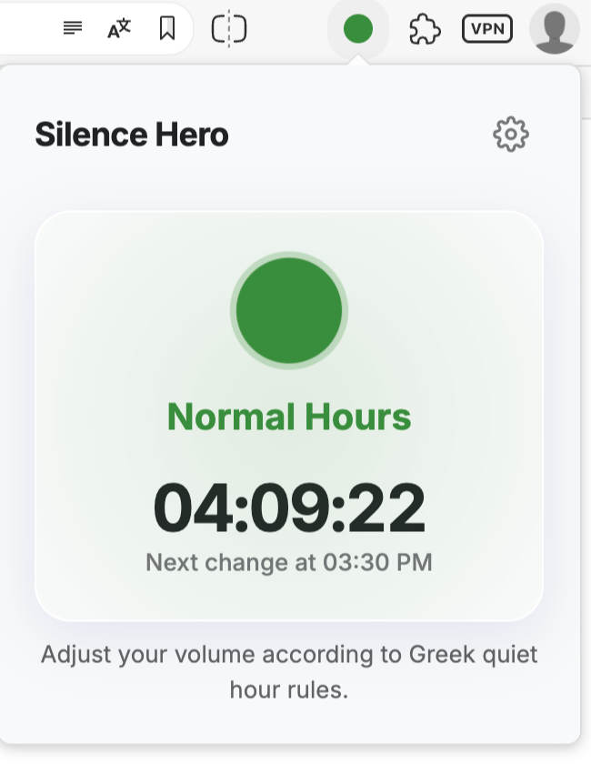

# 🇬🇷 Silence Hero
<p align="center">
  
</p>

Manage your music volume according to **Greek quiet hours** with this simple Chrome extension. Based on [Police Order 3 of 1996](https://www.astynomia.gr/odigos-tou-politi/chrisimes-symvoules/diafores/poies-einai-oi-ores-koinis-isychias/), it provides visual cues and a countdown timer.

---

## ✨ Features

* **Dynamic Icon (🟢 / 🔴):** The extension icon automatically switches between **green** (non-quiet hours) and **soft red** (quiet hours).
* **Helpful Popup:** Click the icon to see:
    * Current status: **Quiet Hours** or **Non-Quiet Hours**.
    * A countdown timer showing time remaining until the next change.
* **Automatic Dark Mode:** The popup automatically switches to a **dark theme** between 8 PM and 6 AM for comfortable night viewing.
* **Smart Time Logic:** Accurately follows official quiet hours, adjusting for summer/winter periods:
    * **Summer (Apr 1 - Sep 30):** 15:00–17:30 & 23:00–07:00
    * **Winter (Oct 1 - Mar 31):** 15:30–17:30 & 22:00–07:30
* **Modern Design:** Clean interface with the Comfortaa font, rounded corners, and light/dark themes inspired by Chrome's UI.

---

## Installation

Choose your preferred method:

**1. Using Git (Recommended)**

   1.  **Clone Repository:**
       Open your terminal and run:
```bash
   git clone https://github.com/Andrewfragkiadakis/Silence-Hero.git
   ```
   2.  **Load in Chrome:**
       * Navigate to `chrome://extensions/`.
       * Enable **Developer mode** using the toggle (usually top-right).
       * Click **Load unpacked**.
       * Select the `music-volume-reminder` folder you just cloned.

**2. Download ZIP**

   1.  **Download:**
       * Go to the repository: [`https://github.com/Andrewfragkiadakis/Silence-Hero`](https://github.com/Andrewfragkiadakis/Silence-Hero)
       * Click the green **Code** button, then select **Download ZIP**.
   2.  **Extract:** Unzip the downloaded file (e.g., `Silence-Hero-main.zip`) on your computer.
   3.  **Load in Chrome:**
       * Navigate to `chrome://extensions/`.
       * Enable **Developer mode**.
       * Click **Load unpacked**.
       * Select the folder you extracted (e.g., `Silence-Hero-main`).

---

## 📸 Screenshots



---

## 📄 License

This project is open-source under the [MIT License](LICENSE).
