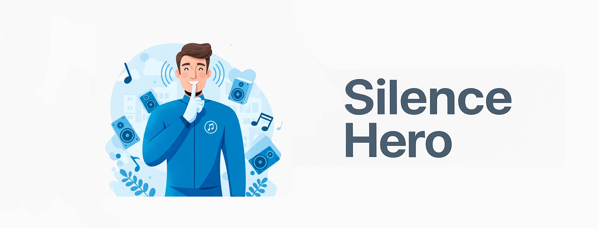
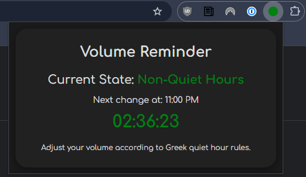

# Silence Hero 🦸‍♂️ - Your Friendly Greek Quiet Hours Reminder



---

**Living in Greece?**

**Love your music loud but hate getting *that knock* from the neighbours (or worse, the police 👮)?**

Fear no more! **Silence Hero** is the simple Chrome extension designed to save your speakers... and your sanity! It's your personal sidekick, keeping track of the official Greek quiet hours (**Police Order 3 of 1996**) so you don't have to constantly check the clock.

**Who is this for?**

* Anyone living in Greece (students, apartment dwellers, families, night owls!)
* Music lovers who sometimes forget the time
* People who host occasional gatherings
* Basically, anyone who wants to enjoy their sound without accidentally becoming *that* neighbour!

Silence Hero gives you a clear heads-up with visual cues and a countdown timer, letting you know exactly when it's time to turn it down (or crank it back up!).

## ✨ Features (aka Superpowers!)

* **Dynamic Icon (🟢 / 🔴):** The extension icon is your instant status check! It automatically switches between **green** (Go Loud!) and a **soft red** (Shhh... Quiet Hours) based on the current time.
* **Helpful Popup:** Click the icon for the intel:
    * **Current status:** Clearly states `Quiet Hours` or `Non-Quiet Hours`.
    * **Countdown Timer:** Shows exactly how much time is left until the next status change. No more guesswork!
* **Automatic Dark Mode:** Like a true hero working in the shadows, the popup automatically switches to a **dark theme** between 8 PM and 6 AM for comfortable night viewing. Your eyes will thank you.
* **Smart Time Logic:** Knows the difference! Accurately follows the official quiet hours and automatically adjusts for the summer/winter periods:
    * **Summer (Apr 1 - Sep 30):** 15:00–17:30 & 23:00–07:00
    * **Winter (Oct 1 - Mar 31):** 15:30–17:30 & 22:00–07:30
* **Modern Design:** A clean, easy-to-read interface using the Comfortaa font, smooth rounded corners, and slick light/dark themes inspired by Chrome's own UI.

## 🚀 Installation

Ready to become a Silence Hero? Installing is easy-peasy:

**Choose your preferred method:**

### 1. Using Git (Recommended for Developers)

1.  **Clone Repository:** Open your terminal/command prompt and run:
    ```bash
    git clone https://github.com/Andrewfragkiadakis/Silence-Hero.git
    ```
2.  **Load in Chrome:**
    * Open Chrome and navigate to `chrome://extensions/`.
    * Enable **Developer mode** using the toggle switch (usually in the top-right corner).
    * Click the **Load unpacked** button.
    * Select the `Silence-Hero` (or `music-volume-reminder` if that's the folder name inside) directory you just cloned.

### 2. Download ZIP (Easiest Method)

1. **Download:**  
   * [Click here to download the ZIP file](https://github.com/Andrewfragkiadakis/Silence-Hero/archive/refs/heads/main.zip)
2.  **Extract:** Unzip the downloaded file (e.g., `Silence-Hero-main.zip`) somewhere on your computer.
3.  **Load in Chrome:**
    * Open Chrome and navigate to `chrome://extensions/`.
    * Enable **Developer mode** (toggle switch, usually top-right).
    * Click the **Load unpacked** button.
    * Select the folder you extracted (e.g., `Silence-Hero-main`).

**Boom!** The Silence Hero icon should now appear in your Chrome toolbar, ready for duty!

## 👀 Screenshots



## 📄 License

This project is open-source and free to use under the **MIT License**. Feel free to fork it, improve it, or just enjoy the peace of mind!

## About Me
I’m an IT & Computer Engineering student with expertise in networking, system administration, and web development. 

Built with ❤️ using HTML, CSS, and JavaScript.

